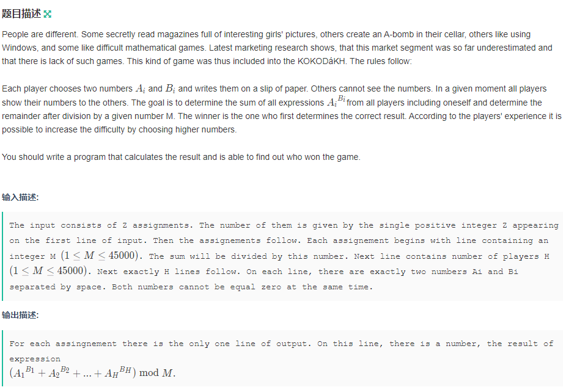

## 基本知识


## 习题

### 计算$a^b$


题目连接：https://ac.nowcoder.com/acm/contest/996/A

**快速幂**的原理：

在计算机中，一个数是用二进制的形式来表示，所以整数**b**可以表示为

$b = c_{k-1}*2^{k - 1} + c_{k - 2}*2^{k-2} +  ... + c_0*2^0$
$$
b = c_{k-1}*2^{k - 1} + c_{k - 2}*2^{k-2} +  ... + c_0*2^0
$$

- **k：** 二进制下b的位数
- **$c_{k - 1}$：**二进制下 `b` 第`k-1`位的值，只有0或1。

那么，原式就可以转变为：
$$
a^b = a^{c_{k-1}*2^{k-1}} * a^{c_{k-2}*2^{k-2}} *... * a^{c_0*2^0}
$$

$$
a^b	= (c_{k-1}*a^{2^{k-1}}) * (c_{k-2}*a^{2^{k-2}}) *..... *(c_{0}*a^{2^{0}})
$$

可得出以下结论：

- 因为$c_{k-1}$的值为0或1，当它为1时，才对结果有贡献

```c++
#include<cstdio>

using namespace std;

typedef long long LL;

int quick_pow(int a, int b, int p)
{
    int ans = 1 % p;
    while(b)
    {
        if (b & 1) ans = (long long)ans * a % p;
        a = (long long)a * a % p;
        b >>= 1;
    }
    return ans % p;
}

int main()
{
    int a, b, p;
    scanf("%d%d%d", &a, &b, &p);
    printf("%d\n", quick_pow(a, b, p));
    return 0;
}
```

**Ps：**

> 在C++语言中，两个数值执行算术运算时，以参与运算的最高数值类型为基准，**与保存结果的变量类型无关**。
>
> 所以运算时，将`ans`从`int`转为`long long `类型，这样不会出现越界情况。

---

### Raising Modulo Numbers

**题目链接：** https://ac.nowcoder.com/acm/contest/996/B




#### 思路

快速幂求和。

AC代码：

```c++
#include<cstdio>

using namespace std;

int quick_pow(int a, int b, int m)
{
    int ans = 1 % m;
    
    while(b)
    {
        if (b & 1) ans = (long long) ans * a % m;
        a = (long long)a * a % m;
        b >>= 1;
    }
    return ans;
}


int main()
{
    int n, m, h;
    scanf("%d", &n);
    
    while(n --)
    {
        scanf("%d%d", &m, &h);
        int x, y, ans = 0;
        for (int i = 0; i < h; i ++)
        {
            scanf("%d%d", &x, &y);
            ans = (ans + quick_pow(x, y, m)) % m;
        }
        printf("%d\n", ans);
    }
    return 0;
}
```

---


