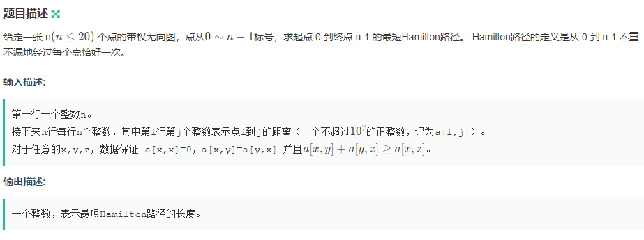

## 基本知识


### 逻辑右移


### 二进制状态压缩

| 操作                                      | 运算                 |
| ----------------------------------------- | -------------------- |
| 取出整数n在二进制表示下的第k位            | `n >> k & 1`         |
| 取出整数n在二进制表示下的第0~k-1位(后k位) | `n & ((1 << k) - 1)` |
| 将整数n在二进制表示下的第k位取反          | `n ^ (1 << k)`       |
| 将整数n在二进制表示下的第k位置为1         | `n | (1 << k)`       |
| 将整数n在二进制表示下的第k位置为0         | ` n & (~(1 << k))`   |


### 成对变换

对于非负整数`n`：

- 当`n`为偶数时，`n xor 1`等于`n + 1`
- 当`n`为奇数时，`n xor 1`等于`n - 1`


## 习题

### 1、计算$a^b$


题目连接：https://ac.nowcoder.com/acm/contest/996/A

**快速幂**的原理：

在计算机中，一个数是用二进制的形式来表示，所以整数**b**可以表示为

$b = c_{k-1}*2^{k - 1} + c_{k - 2}*2^{k-2} +  ... + c_0*2^0$
$$
b = c_{k-1}*2^{k - 1} + c_{k - 2}*2^{k-2} +  ... + c_0*2^0
$$

- **k：** 二进制下b的位数
- **$c_{k - 1}$：**二进制下 `b` 第`k-1`位的值，只有0或1。

那么，原式就可以转变为：
$$
a^b = a^{c_{k-1}*2^{k-1}} * a^{c_{k-2}*2^{k-2}} *... * a^{c_0*2^0}
$$

$$
a^b	= (c_{k-1}*a^{2^{k-1}}) * (c_{k-2}*a^{2^{k-2}}) *..... *(c_{0}*a^{2^{0}})
$$

可得出以下结论：

- 因为$c_{k-1}$的值为0或1，当它为1时，才对结果有贡献

```c++
#include<cstdio>

using namespace std;

typedef long long LL;

int quick_pow(int a, int b, int p)
{
    int ans = 1 % p;
    while(b)
    {
        if (b & 1) ans = (long long)ans * a % p;
        a = (long long)a * a % p;
        b >>= 1;
    }
    return ans % p;
}

int main()
{
    int a, b, p;
    scanf("%d%d%d", &a, &b, &p);
    printf("%d\n", quick_pow(a, b, p));
    return 0;
}
```

**Ps：**

> 在C++语言中，两个数值执行算术运算时，以参与运算的最高数值类型为基准，**与保存结果的变量类型无关**。
>
> 所以运算时，将`ans`从`int`转为`long long `类型，这样不会出现越界情况。

---

### 2、Raising Modulo Numbers

**题目链接：** https://ac.nowcoder.com/acm/contest/996/B


#### 思路

快速幂求和。

AC代码：

```c++
#include<cstdio>

using namespace std;

int quick_pow(int a, int b, int m)
{
    int ans = 1 % m;
    
    while(b)
    {
        if (b & 1) ans = (long long) ans * a % m;
        a = (long long)a * a % m;
        b >>= 1;
    }
    return ans;
}


int main()
{
    int n, m, h;
    scanf("%d", &n);
    
    while(n --)
    {
        scanf("%d%d", &m, &h);
        int x, y, ans = 0;
        for (int i = 0; i < h; i ++)
        {
            scanf("%d%d", &x, &y);
            ans = (ans + quick_pow(x, y, m)) % m;
        }
        printf("%d\n", ans);
    }
    return 0;
}
```

---


### 3、最短Hamilton路径（状压DP）

[题目链接](https://ac.nowcoder.com/acm/contest/996/D)




#### 思路

用`f[i][j]`表示**点被经过的状态**对应的二进制数为`i`，且目前处在于点`j`时的最短路径。

- 所有点恰好经过一次，用二进制`i`表示所有点的经过情况。
  - 规定二进制中0表示未经过，1表示已经过。
- 从`f[1][0]`开始一直到`f[(1 << n) - 1][ n - 1]`。


#### 代码

```c++
#include<cstdio>
#include<cstring>
#include<algorithm>

using namespace std;

int main()
{
    int n;
    scanf("%d", &n);
    int a[n][n], f[1 << n][n];
    
    for (int i = 0; i < n; i ++)
        for (int j = 0; j < n; j ++)
            scanf("%d", &a[i][j]);
    // 方便起见，将f初始化为无穷大
    memset(f, 0x3f, sizeof f);
    
    // 初始化，在0点，f为0
    f[1][0] = 0;
    // 遍历所有的情况，
    for (int i = 1; i < 1 << n; i ++)
    {
        for (int j = 0; j < n; j ++)
        {
            if (i >> j & 1) // 取出第j位，即判断i存储的路径中是否有j节点的存在，如果没有j节点，那么就不需要往下走了
            {
                for (int k = 0; k < n; k ++)
                {
                    // i^1<<j 将第j位取反，防止重复走
                    // (i^1<<j) >> k & 1 取出第k位，第k位是否被经过
                    if ((i ^ 1 << j) >> k & 1)
                    {
                        f[i][j] = min(f[i][j], f[i ^ 1 << j][k] + a[k][j]);
                    }
                }
            }
        }
    }
    
    printf("%d\n", f[(1 << n) - 1][n - 1]);
    return 0;
}
```


