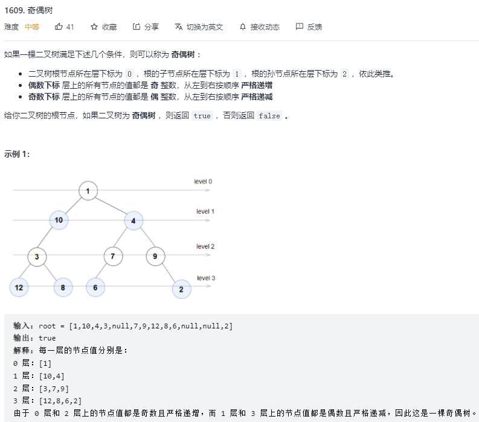

## 基本知识

数的层序遍历BFS


## 基本题型

### 1、[奇偶树](https://leetcode-cn.com/problems/even-odd-tree/)



#### 思路

- 层序遍历
- DFS(需要记录每层的最大/小值)

#### 代码

**DFS:**

```cpp
/**
 * Definition for a binary tree node.
 * struct TreeNode {
 *     int val;
 *     TreeNode *left;
 *     TreeNode *right;
 *     TreeNode() : val(0), left(nullptr), right(nullptr) {}
 *     TreeNode(int x) : val(x), left(nullptr), right(nullptr) {}
 *     TreeNode(int x, TreeNode *left, TreeNode *right) : val(x), left(left), right(right) {}
 * };
 */
class Solution {
public:
    int a[100005];
    bool isEvenOddTree(TreeNode* root) {
        return dfs(root, 0);
    }

    bool dfs(TreeNode* root, int level)
    {
        if (root == nullptr) return true;

        if ((level & 1) ^ (root->val & 1))
        {
            if (a[level] == 0) a[level] = root->val;
            else {
                if (((level & 1) && (a[level] > root -> val)) || (!(level & 1) && (a[level] < root -> val)))
                {
                    a[level] = root->val;
                } else {
                    return false;
                }
            }
            return dfs(root->left, level + 1) && dfs(root->right, level + 1);
        }
        return false;
    }
};
```

**BFS:**

```cpp
/**
 * Definition for a binary tree node.
 * struct TreeNode {
 *     int val;
 *     TreeNode *left;
 *     TreeNode *right;
 *     TreeNode() : val(0), left(nullptr), right(nullptr) {}
 *     TreeNode(int x) : val(x), left(nullptr), right(nullptr) {}
 *     TreeNode(int x, TreeNode *left, TreeNode *right) : val(x), left(left), right(right) {}
 * };
 */
class Solution {
public:
    bool isEvenOddTree(TreeNode* root) {
        queue<TreeNode*> q;
        q.push(root);

        int level = 1, n, prev;
        while(!q.empty())
        {
            n = q.size();
            prev = level & 1 ? 0:0x3f3f3f3f;
            for (int i = 0; i < n; i ++)
            {
                TreeNode* t = q.front();
                q.pop();
                if ((level & 1) ^ (t-> val & 1)) return false;
                if ((level & 1) && (t->val <= prev)) return false;
                if ((!(level & 1)) && (t->val >= prev)) return false;

                if (t->left != nullptr) q.push(t->left);
                if (t->right != nullptr) q.push(t->right);
                prev = t->val;
            }
            level ++;
        }
        return true;
    }
};
```

