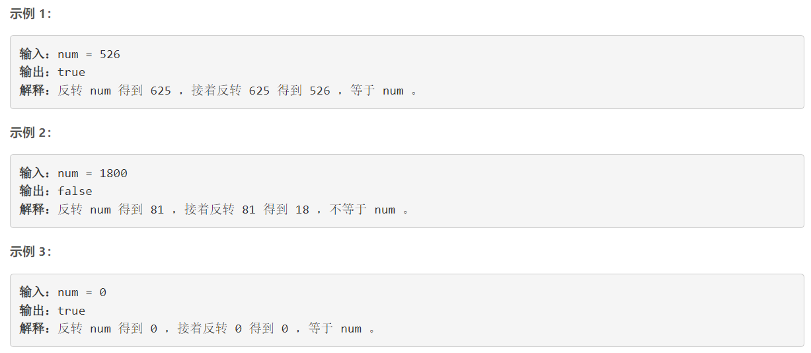
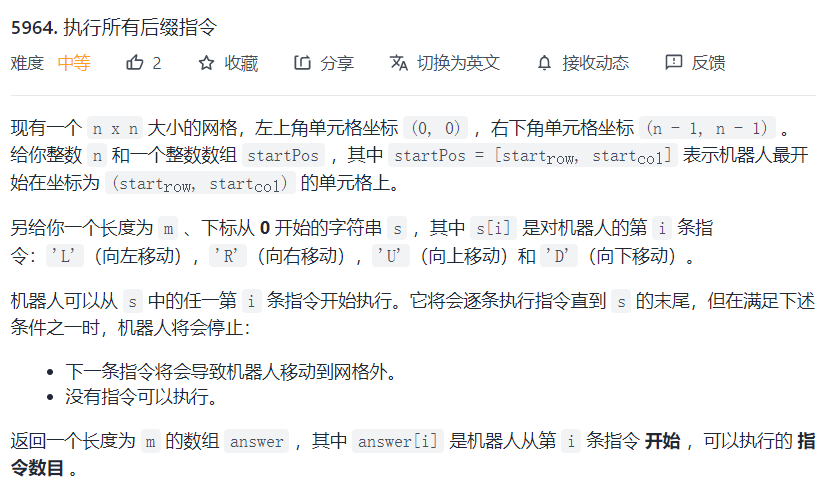
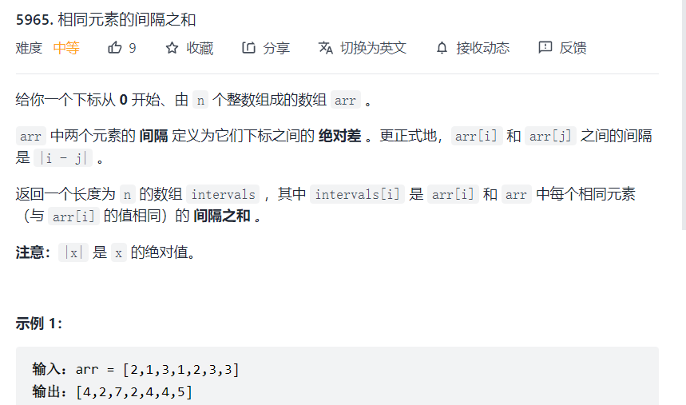
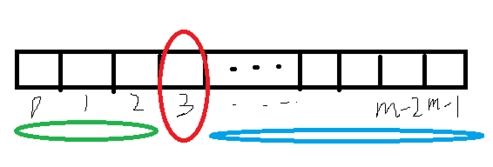
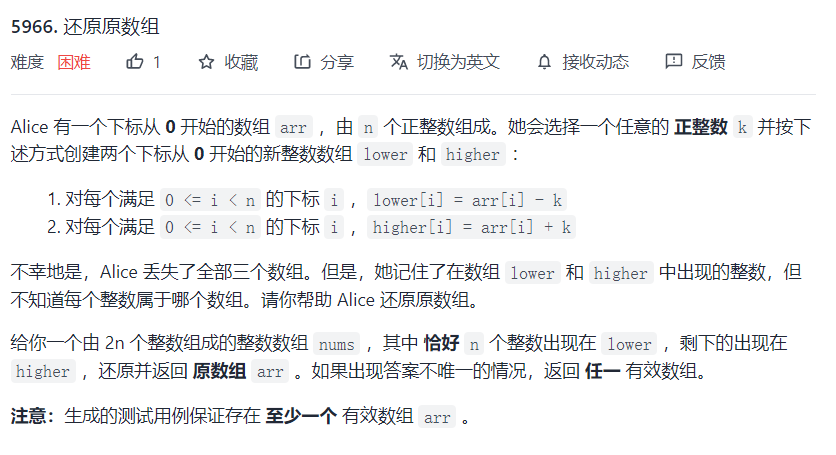

## 5963. 反转两次的数字

[题目链接](https://leetcode-cn.com/problems/a-number-after-a-double-reversal/)

**反转** 一个整数意味着倒置它的所有位。

- 例如，反转 `2021` 得到 `1202` 。反转 `12300` 得到 `321` ，**不保留前导零** 。

给你一个整数 `num` ，**反转** `num` 得到 `reversed1` ，**接着反转** `reversed1` 得到 `reversed2` 。如果 `reversed2` 等于 `num` ，返回 `true` ；否则，返回 `false` 。



**提示：**

- `0 <= num <= 106`

### 思路

略

### 代码

```cpp
class Solution {
public:
    bool isSameAfterReversals(int num) {
        if (num % 10 == 0 && num > 0)
        {
            return false;
        }
        return true;
    }
};
```

---

## 5964. 执行所有后缀指令

[题目链接](https://leetcode-cn.com/problems/execution-of-all-suffix-instructions-staying-in-a-grid/)



### 思路

略

### 代码

```cpp
class Solution {
public:
    bool judge(int i, int j, int n)
    {
        if (i >= 0 && i < n && j >= 0 && j < n) return true;
        return false;
    }
    vector<int> executeInstructions(int n, vector<int>& startPos, string s) {
        int len = s.size();
        vector<int> ans;
        for (int i = 0; i < len; i ++)
        {
            int p = startPos[0], q = startPos[1], cnt = 0;
            for (int j = i; j < len; j ++)
            {
                char c = s[j];
                if (c == 'L') q --;
                else if (c == 'R') q ++;
                else if (c == 'U') p --;
                else p ++;
                
                if (!judge(p, q, n)) break;
                cnt ++;
            }
            ans.push_back(cnt);
        }
        return ans;
    }
};
```

---

## 5965. 相同元素的间隔之和

[题目链接](https://leetcode-cn.com/problems/intervals-between-identical-elements/)



### 思路

1. 利用`map<int, vector<int>>`做额外存储，key为`arr[i]`，value为`arr`数组中所有和`arr[i]`相等的索引值。

2. 对于每一个`key`对应的`vector<int>`，计算每一个元素对应下的间隔之和。
   - `红圈处的间隔之和` = `蓝线对应的所有元素之和 ` - `(m - i) * 红圈元素` +  `i * 红圈元素`  - `绿线对应的所有元素之和 `



### 代码

```cpp
class Solution {
public:
    vector<long long> getDistances(vector<int>& arr) {
        vector<long long> ans(arr.size());
        
        map<int, vector<int>> mm;
        
        for (int i = 0; i < arr.size(); i ++) 
        {
            mm[arr[i]].push_back(i);
        }
        
        for (auto &t : mm)
        {
            auto nums = t.second;
            int m = nums.size();
            long long cnt = 0, prev = 0;
            for (int j = 0; j < m; j ++)
            {
                cnt += nums[j];
            }
            for (int i = 0; i < m; i ++)
            {
                ans[nums[i]] = cnt + (long long)(2*i - m) * nums[i] - prev;
                cnt -= nums[i];
                prev += nums[i];
            }
            
        }
        return ans;
    }
};
```


---

## 5966. 还原原数组

[题目链接](https://leetcode-cn.com/problems/recover-the-original-array/)



### 思路

先分析：

- 所有元素之和一定偶数，且为原数组之和的二倍。
- 对于有效数组来说，两个元素之差 == 2 * k

做法：

- 为了缩短时间，可以先将数组排序，同时这样遍历的时候计算出来的所有的k都为正数，
- 遍历所有元素：k = 该元素 - 第一个元素
  - 如果k不为偶数，或者k == 0，continue;
  - 否则：严证该k是否有效
    1. 借助STL，对每一个元素x来说，如果x+k存在，则将x、x+k都剔除，加入到结果集中。
    2. 如果结果集中的数量 == k / 2，那就说明找全了。return res；


### 代码

```cpp
class Solution {
public:
    vector<int> recoverArray(vector<int>& nums) {
        
        int len = nums.size();
        sort(nums.begin(), nums.end());
        for (int i = 0; i < len; i ++)
        {
            int span = nums[i] - nums[0];
            if ((span & 1) || span  == 0) continue;
            
            multiset<int> s(nums.begin(), nums.end());
            
            vector<int> res;
            while(s.size())
            {
                int x = *s.begin();
                s.erase(s.begin());
                auto it = s.find(x + span);
                if (it == s.end()) break;
                s.erase(it);
                res.push_back(x + span / 2);
            }
            if (res.size() == nums.size() / 2) return res; 
        }
        
        return {};
    }
};
```

