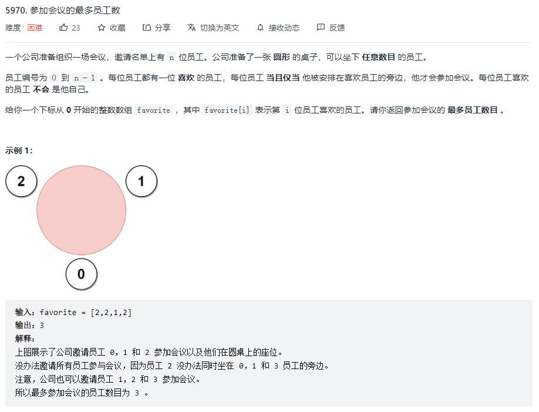

> 早上十点9分左右醒了，没有洗漱就赶来参加LeetCode周赛
>
> 前三题都比较简单，T3当时想到数据范围了，但是没修改就交了，果然WA了一下。
>
> T4现在没思路，感觉今天补不了题了。

#### T4-参加会议的最多员工数

[题目链接](https://leetcode-cn.com/problems/maximum-employees-to-be-invited-to-a-meeting/)

等待补题目。